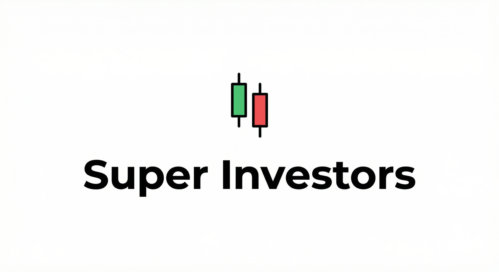

<p align="center">
  
</p>

<p align="center">
  <strong>Rank and analyze famous investors’ track records</strong>
</p>

<p align="center">
  Data from <a href="https://www.dataroma.com/">Dataroma</a> (13F) and <a href="https://finance.yahoo.com/">Yahoo Finance</a>
</p>

<p align="center">
  <a href="https://github.com/abdel-ely-ds/super_investors"></a>
  <a href="LICENSE"></a>
  <a href="https://www.python.org/"></a>
</p>


---

## Contents

- [What is this?](#what-is-this)
- [Get started (3 steps)](#get-started-3-steps)
- [Commands](#commands)
- [Data](#data)
- [Estimation scenarios](#estimation-scenarios)
- [Caveats](#caveats)
- [Support](#support)
- [License](#license)

---

## What is this?

**Super Investors** sits between a spreadsheet and a full backtester: it uses public 13F-style data and price ranges to **rank** investors by performance metrics and **analyze** individual track records.

- **Rank** — Top and flop investors by weighted return, win rate, median returns, sizing skill, and more.
- **Analyze** — Per-investor view: return distribution, best/worst trades, largest positions.
- **Fetch** — Refresh or extend the stats cache from [Dataroma](https://www.dataroma.com/m/home.php) and Yahoo Finance.

Pre-built stats for **81 investors** are included in `stats.zip`; no fetch required to start.

---

## Get started (3 steps)

**Prerequisites:** Python 3.10+

```bash
# 1. Unzip pre-built stats (81 investors, updated 2026-02-18)
unzip stats.zip

# 2. Install dependencies
pip install -r requirements.txt

# 3. Rank by weighted return (top 3 & flop 3)
python rank_investors.py --metric Weighted_Return --min-trades 10 --mode avg --topk 3
```

**Example output:**


Then analyze a single investor:

```bash
python analyze_investor.py "Warren Buffett"
```

---

## Commands

Run everything from the **project root**.

| Action | Script | Purpose |
|--------|--------|---------|
| **Rank** | `rank_investors.py` | Top / flop investors by a chosen metric |
| **Analyze** | `analyze_investor.py` | One investor: overview, returns, best/worst trades, positions |
| **Fetch** | `fetch_all_stats.py` | Rebuild or extend `stats/` from Dataroma + Yahoo (optional) |

---

### Rank investors

```bash
python rank_investors.py                              # default: Weighted Return, top 3 & flop 3
python rank_investors.py -m Win_Rate -k 5             # by win rate, show 5
python rank_investors.py -m Median_Return_Losers      # by median loss (downside)
python rank_investors.py --list-metrics               # list all metrics
```

**Metrics:** `Weighted_Return`, `Win_Rate`, `Pct_Capital_Winning_Stocks`, `Median_Return`, `Median_Return_Winners`, `Median_Return_Losers`, `Sizing_Skill`, `Safety_And_Returns`

---

### Analyze one investor

```bash
python analyze_investor.py "Warren Buffett"
python analyze_investor.py "Thomas Russo" -k 3 --mode best
python analyze_investor.py --list                     # list cached investors
python analyze_investor.py "Li Lu" --refresh           # re-fetch then analyze
```

---

### Fetch stats (optional)

Use this to refresh data or add investors. Requires network; can be slow. Unzipping `stats.zip` already gives you 81 investors.

```bash
python fetch_all_stats.py                  # fetch only missing
python fetch_all_stats.py --refresh        # re-fetch everyone
python fetch_all_stats.py --only "Warren Buffett" "Li Lu"
```

---

## Data

| Item | Description |
|------|-------------|
| **Source** | [Dataroma](https://www.dataroma.com/m/home.php) (13F-style portfolio activity) |
| **Prices** | Yahoo Finance (quarterly low/median/high) |
| **Investors** | Defined in [`investors.py`](investors.py) (name → fund ID). Add more using the fund ID from the Dataroma URL. |
| **Pre-built** | `stats.zip` → unzip to get `stats/<Name>.csv` per investor. |

---

## Estimation scenarios

We don’t know the **exact** price at each buy/sell; only quarterly price ranges. Returns are estimated under three scenarios:

| `--mode` | Meaning |
|----------|---------|
| **`avg`** | Mid-range (default). Reasonable baseline. |
| **`best`** | Optimistic: buy at quarter low, sell at quarter high. |
| **`worst`** | Pessimistic: buy at quarter high, sell at quarter low. |

Use with **rank** and **analyze** to stress-test or compare:

```bash
python rank_investors.py --mode best
python analyze_investor.py "Warren Buffett" --mode worst
```

---

## Caveats

We cannot always fetch price data from Yahoo Finance (e.g. delisted tickers, rate limits, or missing history). When that happens, **those stocks are skipped** and only positions with valid prices are used. As a result, stats (returns, win rate, rankings) can be based on a subset of an investor’s actual portfolio and may not reflect their full track record. Keep this in mind when comparing investors or interpreting metrics.

---

## Support

If this project is useful to you, please **star the repo** on GitHub — it helps others discover it.

You can also support further development:

[](https://www.buymeacoffee.com/ShamelessCloner)

---

## License

MIT. See [LICENSE](LICENSE).
